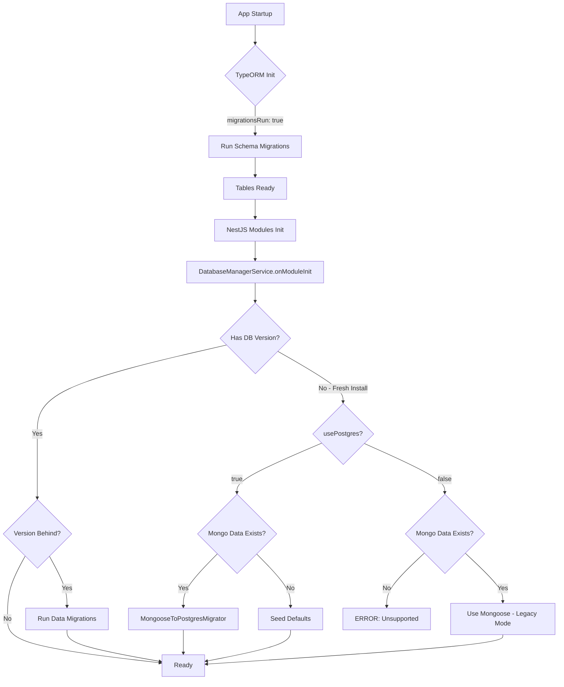

# MongoDB to PostgreSQL Migration Strategy

This document outlines the architecture and strategy for migrating the Wario backend from MongoDB (Mongoose) to PostgreSQL (TypeORM).

## Core Philosophy

Our migration strategy distinguishes between **Schema Evolution (DDL)** and **Data Evolution (DML)** to maintain code quality and leverage existing domain logic (SCD2).

### 1. Hybrid Migration Approach

| Type             | Valid Handler              | Why?                                                                                                                                                       |
| :--------------- | :------------------------- | :--------------------------------------------------------------------------------------------------------------------------------------------------------- |
| **Schema (DDL)** | **TypeORM Migrations**     | Best tool for creating tables, indices, and foreign keys. Handles raw SQL safely.                                                                          |
| **Data (DML)**   | **DatabaseManagerService** | Complex backfills (e.g., SCD2 versioning) require domain logic living in `NestJS Providers`. Injecting these into TypeORM CLI contexts is an anti-pattern. |



### 2. Configuration Architecture

Configuration is centralized in `src/config/typeorm-config.helper.ts` to ensure **identical settings** between:

- **NestJS Runtime** (`app.module.ts`) - uses injected `AppConfigService`
- **TypeORM CLI** (`ormconfig.ts`) - uses standalone `AppConfigService`

```typescript
// CLI (ormconfig.ts):
const appConfig = createStandaloneAppConfig();
const options = buildTypeOrmConfig({ host: appConfig.postgresHost, ... });

// NestJS (app.module.ts):
TypeOrmModule.forRootAsync({
  useFactory: (appConfig) => ({
    ...buildTypeOrmConfig({ host: appConfig.postgresHost, ... }, { migrationsRun: true }),
  }),
});
```

### 3. Startup Safety & Timing

To prevent race conditions where application modules access the database before tables exist:

- **Configuration**: We use `migrationsRun: true` in `app.module.ts`.
- **Effect**: The application boot process **blocks** at the TypeORM initialization step until all Schema Migrations have applied. This guarantees that by the time any Service is instantiated, the database schema is ready.

### 4. FK Constraint Handling

Circular references between `products` ↔ `product_instances` require special handling:

| Migration                        | Timing                | Purpose                                 |
| :------------------------------- | :-------------------- | :-------------------------------------- |
| `DeferCircularFKConstraints`     | Before data migration | Drops FK constraints to allow insertion |
| `ReinstateCircularFKConstraints` | After data migration  | Re-adds FK constraints for integrity    |

> [!WARNING]
> The reinstatement migration uses `IF NOT EXISTS` checks for idempotency. If data violates FK constraints, the migration will fail - fix data first.

### 5. Initialization Logic (`DatabaseManagerService`)

When the application starts, it performs a safety check to determine if it is a **Fresh Install**, a **Migration Candidate**, or a **Corrupted State**.

#### Safety Guard (`checkSafeToInitialize`)

Since tables always exist (due to auto-migrations), we cannot check for table existence. Instead, we check for **existing data**.

- **Check**: `COUNT(*) > 0` on critical tables (`products`, `orders`).
- **Scenario A (Data exists, Version missing)**: **FATAL ERROR**. Manual intervention required.
- **Scenario B (No data)**: Safe to proceed with initialization or migration.

#### Legacy Migration (Mongo -> Postgres)

If the system detects a valid MongoDB connection with data, but an empty PostgreSQL database, it triggers the `MongooseToPostgresMigrator`.

- This service maps Mongoose Documents -> TypeORM Entities.
- Handles standard columns (`name`, `price`) and special SCD2 columns (`rowId`, `validFrom`, `validTo`).
- **Included Collections**: `orders`, `products`, `settings`, `printing`, `fulfillments`, and more.

---

## Developer Workflow

### Creating Schema Changes

1. **Modify Entity**: Update the `.entity.ts` file in `src/entities`.
2. **Generate Migration**:
   ```bash
   cd apps/wario-backend
   npx typeorm migration:generate -d ormconfig.ts src/migrations/NameOfChange
   ```
3. **Review**: Check the generated SQL file for correctness.
4. **Apply**: Restart the server (auto-runs) or use:
   ```bash
   npx typeorm migration:run -d ormconfig.ts
   ```

### Creating Data Backfills

1. **Modify `DatabaseManagerService`**: Add a new step to the `POSTGRES_MIGRATIONS` dictionary.
   ```typescript
   '1.2.0': [{ major: 1, minor: 2, patch: 1 }, async (manager) => {
     await manager.query(`UPDATE products SET ...`);
   }]
   ```
2. **Testing**: Add a specific test case in `migration.e2e-spec.ts`.

---

## Testing

We have a dedicated E2E test suite for migration logic.

- **File**: `test/migration.e2e-spec.ts`
- **Behavior**:
  1. Drops/Seeds a test MongoDB instance.
  2. Starts the Backend (triggering migration).
  3. Verifies data integrity in PostgreSQL.
- **Run Manually**:
  ```bash
  cd apps/wario-backend
  TEST_MIGRATION=true pnpm jest test/migration.e2e-spec.ts
  ```

See `test/setup-env.ts` for environment configuration.
