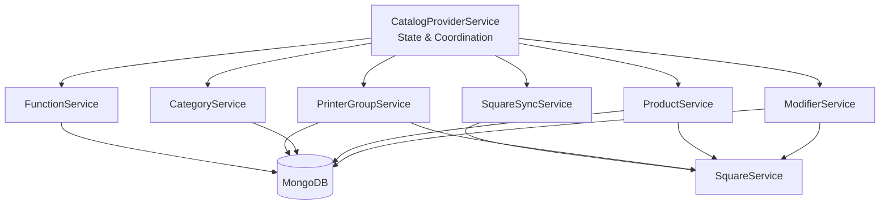

# Catalog Provider Refactoring Plan

## Overview

The `CatalogProviderService` is a 2,044-line monolith that handles CRUD operations for 8 entity types, Square synchronization, and catalog state management. This plan breaks it into focused, testable services following NestJS best practices.

## Proposed Architecture



---

## New Services

### 1. `CatalogProviderService` (Coordinator)
**File:** `catalog-provider.service.ts` (slimmed down)
**Responsibility:** State management, sync coordination, catalog recomputation

| Current Function | Action |
|-----------------|--------|
| `constructor` | Keep - inject new services |
| `onModuleInit` | Keep |
| `RequireSquareRebuild` (setter) | Keep |
| `PrinterGroups` (getter) | Keep |
| `Categories` (getter) | Keep |
| `ModifierTypes` (getter) | Keep |
| `ModifierOptions` (getter) | Keep |
| `Products` (getter) | Keep |
| `ProductInstances` (getter) | Keep |
| `ProductInstanceFunctions` (getter) | Keep |
| `OrderInstanceFunctions` (getter) | Keep |
| `Catalog` (getter) | Keep |
| `ReverseMappings` (getter) | Keep |
| `CatalogSelectors` (getter) | Keep |
| `SyncCategories` | Keep |
| `SyncPrinterGroups` | Keep |
| `SyncModifierTypes` | Keep |
| `SyncOptions` | Keep |
| `SyncProducts` | Keep |
| `SyncProductInstances` | Keep |
| `SyncProductInstanceFunctions` | Keep |
| `SyncOrderInstanceFunctions` | Keep |
| `RecomputeCatalog` | Keep |
| `RecomputeCatalogAndEmit` | Keep |
| `Bootstrap` | Keep - call SquareSyncService methods |

---

### 2. `ModifierService`
**File:** `modifier.service.ts`  
**Responsibility:** ModifierTypes + ModifierOptions CRUD

| Current Function | New Name | Notes |
|-----------------|----------|-------|
| `CreateModifierType` | `createModifierType` | |
| `BatchUpdateModifierType` | `batchUpdateModifierType` | |
| `UpdateModifierType` | `updateModifierType` | |
| `DeleteModifierType` | `deleteModifierType` | |
| `CreateOption` | `createOption` | |
| `UpdateModifierOption` | `updateOption` | |
| `BatchUpdateModifierOption` | `batchUpdateOption` | |
| `DeleteModifierOption` | `deleteOption` | |

**Dependencies:**
- `SquareService` - for Square catalog sync
- `CatalogProviderService` - for state access (use `forwardRef`)
- Mongoose models: `WOptionType`, `WOption`

---

### 3. `ProductService`
**File:** `product.service.ts`  
**Responsibility:** Products + ProductInstances CRUD

| Current Function | New Name | Notes |
|-----------------|----------|-------|
| `CreateProduct` | `createProduct` | |
| `BatchUpsertProduct` | `batchUpsertProduct` | Large method (~400 lines) |
| `UpdateProduct` | `updateProduct` | |
| `BatchDeleteProduct` | `batchDeleteProduct` | |
| `DeleteProduct` | `deleteProduct` | |
| `CreateProductInstance` | `createProductInstance` | |
| `BatchUpdateProductInstance` | `batchUpdateProductInstance` | |
| `UpdateProductInstance` | `updateProductInstance` | |
| `DeleteProductInstance` | `deleteProductInstance` | |
| `UpdateProductsReferencingModifierTypeId` | `updateProductsReferencingModifierTypeId` | |
| `UpdateProductsWithConstraint` | `updateProductsWithConstraint` | |

**Dependencies:**
- `SquareService` - for Square catalog sync
- `CatalogProviderService` - for state access (use `forwardRef`)
- Mongoose models: `WProduct`, `WProductInstance`

---

### 4. `CategoryService`
**File:** `category.service.ts`  
**Responsibility:** Categories CRUD

| Current Function | New Name | Notes |
|-----------------|----------|-------|
| `CreateCategory` | `createCategory` | |
| `UpdateCategory` | `updateCategory` | Handles cycle detection |
| `DeleteCategory` | `deleteCategory` | |

**Dependencies:**
- `CatalogProviderService` - for state access (use `forwardRef`)
- `ProductService` - for cascading deletes
- `DataProviderService` - for fulfillment validation
- Mongoose model: `WCategory`

---

### 5. `PrinterGroupService`
**File:** `printer-group.service.ts`  
**Responsibility:** PrinterGroups CRUD

| Current Function | New Name | Notes |
|-----------------|----------|-------|
| `CreatePrinterGroup` | `createPrinterGroup` | |
| `BatchUpdatePrinterGroup` | `batchUpdatePrinterGroup` | |
| `UpdatePrinterGroup` | `updatePrinterGroup` | |
| `DeletePrinterGroup` | `deletePrinterGroup` | |

**Dependencies:**
- `SquareService` - for Square catalog sync
- `CatalogProviderService` - for state access (use `forwardRef`)
- `ProductService` - for cascading updates
- Mongoose model: `WPrinterGroup`

---

### 6. `FunctionService`
**File:** `function.service.ts`  
**Responsibility:** ProductInstanceFunctions + OrderInstanceFunctions CRUD

| Current Function | New Name | Notes |
|-----------------|----------|-------|
| `CreateProductInstanceFunction` | `createProductInstanceFunction` | |
| `UpdateProductInstanceFunction` | `updateProductInstanceFunction` | |
| `DeleteProductInstanceFunction` | `deleteProductInstanceFunction` | |
| `CreateOrderInstanceFunction` | `createOrderInstanceFunction` | |
| `UpdateOrderInstanceFunction` | `updateOrderInstanceFunction` | |
| `DeleteOrderInstanceFunction` | `deleteOrderInstanceFunction` | |

**Dependencies:**
- `CatalogProviderService` - for state access (use `forwardRef`)
- Mongoose models: `WProductInstanceFunction`, `WOrderInstanceFunction`

---

### 7. `SquareSyncService`
**File:** `square-sync.service.ts`  
**Responsibility:** Square catalog synchronization and validation

| Current Function | New Name | Notes |
|-----------------|----------|-------|
| `LocationsConsidering3pFlag` | `getLocations` | Make public |
| `BatchDeleteCatalogObjectsFromExternalIds` | `batchDeleteFromExternalIds` | |
| `CheckAllPrinterGroupsSquareIdsAndFixIfNeeded` | `syncPrinterGroups` | |
| `CheckAllModifierTypesHaveSquareIdsAndFixIfNeeded` | `syncModifierTypes` | |
| `CheckAllProductsHaveSquareIdsAndFixIfNeeded` | `syncProducts` | |
| `ForceSquareCatalogCompleteUpsert` | `forceFullSync` | |

**Dependencies:**
- `SquareService` - for Square API calls
- `CatalogProviderService` - for state access (use `forwardRef`)
- `PrinterGroupService`, `ModifierService`, `ProductService` - for updates

---

### 8. Utility Functions (Keep in `CatalogProviderService` or extract)

| Current Function | Location | Notes |
|-----------------|----------|-------|
| `BackfillRemoveFulfillment` | Keep in `CatalogProviderService` | Cross-cutting concern |
| `ValidateProductModifiersFunctionsCategoriesPrinterGroups` | Move to utils | Pure validation |
| `isUpdateProduct` | Move to utils | Type guard |
| `isUpdateProductInstance` | Move to utils | Type guard |

---

## File Structure

```
src/config/catalog-provider/
├── catalog-provider.module.ts       # Updated module (imports all services)
├── catalog-provider.service.ts      # Slimmed coordinator (state + sync)
├── modifier.service.ts              # ModifierTypes + ModifierOptions
├── product.service.ts               # Products + ProductInstances
├── category.service.ts              # Categories
├── printer-group.service.ts         # PrinterGroups
├── function.service.ts              # ProductInstance + OrderInstance Functions
├── square-sync.service.ts           # Square catalog synchronization
└── catalog.types.ts                 # Shared types (UpdateProps, etc.)
```

All services stay in the same folder since they're tightly coupled and share the same module.

---

## Implementation Phases

### Phase 1: Extract FunctionService (Lowest Risk)
- ProductInstanceFunctions and OrderInstanceFunctions are self-contained
- No Square integration
- Simple CRUD operations
- ~100 lines

### Phase 2: Extract CategoryService
- No Square integration
- Simple CRUD with cycle detection
- ~90 lines

### Phase 3: Extract PrinterGroupService
- Has Square integration
- Moderate complexity
- ~115 lines

### Phase 4: Extract ModifierService
- Has Square integration
- Moderate complexity
- ~450 lines

### Phase 5: Extract ProductService
- Has Square integration
- Most complex due to `BatchUpsertProduct`
- ~670 lines

### Phase 6: Extract SquareSyncService
- Square validation and sync logic
- ~200 lines

### Phase 7: Slim down CatalogProviderService
- Should be ~400 lines after extraction
- State management and coordination only

---

## Circular Dependency Strategy

Several services need to reference each other. Use NestJS `forwardRef`:

```typescript
// In ProductService
constructor(
  @Inject(forwardRef(() => CatalogProviderService))
  private catalogProvider: CatalogProviderService,
) {}
```

**Dependency Graph:**
- `CatalogProviderService` → all other services
- `PrinterGroupService` → `ProductService` (for cascading updates)
- `CategoryService` → `ProductService` (for cascading deletes)
- `ModifierService` → `ProductService` (for cascading updates)
- `SquareSyncService` → `PrinterGroupService`, `ModifierService`, `ProductService`

---

## Testing Strategy

Each new service should have:
1. **Unit tests** - Mock dependencies, test business logic
2. **Integration tests** - Test with real MongoDB (using test containers)
3. **E2E tests** - Test full flow through controllers

---

## Migration Checklist

- [ ] Phase 1: Extract FunctionService
  - [ ] Create `function.module.ts` and `function.service.ts`
  - [ ] Move 6 functions
  - [ ] Update `CatalogProviderService` to use `FunctionService`
  - [ ] Update module imports
  - [ ] Verify tests pass

- [ ] Phase 2: Extract CategoryService
  - [ ] Create `category.module.ts` and `category.service.ts`
  - [ ] Move 3 functions
  - [ ] Update `CatalogProviderService` to use `CategoryService`
  - [ ] Update module imports
  - [ ] Verify tests pass

- [ ] Phase 3: Extract PrinterGroupService
  - [ ] Create `printer-group.module.ts` and `printer-group.service.ts`
  - [ ] Move 4 functions
  - [ ] Update `CatalogProviderService` to use `PrinterGroupService`
  - [ ] Update module imports
  - [ ] Verify tests pass

- [ ] Phase 4: Extract ModifierService
  - [ ] Create `modifier.module.ts` and `modifier.service.ts`
  - [ ] Move 8 functions
  - [ ] Update `CatalogProviderService` to use `ModifierService`
  - [ ] Update module imports
  - [ ] Verify tests pass

- [ ] Phase 5: Extract ProductService
  - [ ] Create `product.module.ts` and `product.service.ts`
  - [ ] Move 11 functions
  - [ ] Update `CatalogProviderService` to use `ProductService`
  - [ ] Update module imports
  - [ ] Verify tests pass

- [ ] Phase 6: Extract SquareSyncService
  - [ ] Create `square-sync.module.ts` and `square-sync.service.ts`
  - [ ] Move 6 functions
  - [ ] Update `CatalogProviderService.Bootstrap` to use `SquareSyncService`
  - [ ] Update module imports
  - [ ] Verify tests pass

- [ ] Phase 7: Final Cleanup
  - [ ] Review slimmed `CatalogProviderService`
  - [ ] Update documentation
  - [ ] Performance testing

---

## Status

**Proposed** - Ready for implementation when prioritized.
