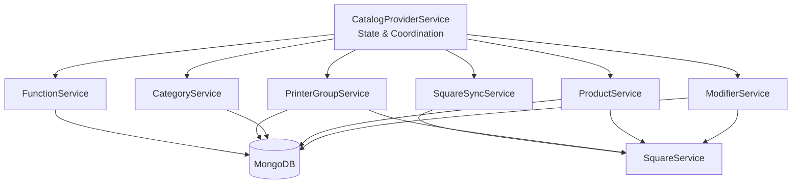

# Catalog Provider Refactoring Plan

## Overview

The `CatalogProviderService` is a 2,044-line monolith that handles CRUD operations for 8 entity types, Square synchronization, and catalog state management. This plan breaks it into focused, testable services following NestJS best practices.

## Proposed Architecture



---

## New Services

### 1. `CatalogProviderService` (Coordinator)
**File:** `catalog-provider.service.ts` (slimmed down)
**Responsibility:** State management, sync coordination, catalog recomputation

| Current Function | Action |
|-----------------|--------|
| `constructor` | Keep - inject new services |
| `onModuleInit` | Keep |
| `RequireSquareRebuild` (setter) | Keep |
| `PrinterGroups` (getter) | Keep |
| `Categories` (getter) | Keep |
| `ModifierTypes` (getter) | Keep |
| `ModifierOptions` (getter) | Keep |
| `Products` (getter) | Keep |
| `ProductInstances` (getter) | Keep |
| `ProductInstanceFunctions` (getter) | Keep |
| `OrderInstanceFunctions` (getter) | Keep |
| `Catalog` (getter) | Keep |
| `ReverseMappings` (getter) | Keep |
| `CatalogSelectors` (getter) | Keep |
| `SyncCategories` | Keep |
| `SyncPrinterGroups` | Keep |
| `SyncModifierTypes` | Keep |
| `SyncOptions` | Keep |
| `SyncProducts` | Keep |
| `SyncProductInstances` | Keep |
| `SyncProductInstanceFunctions` | Keep |
| `SyncOrderInstanceFunctions` | Keep |
| `RecomputeCatalog` | Keep |
| `RecomputeCatalogAndEmit` | Keep |
| `Bootstrap` | Keep - call SquareSyncService methods |

---

### 2. `CatalogModifierService`
**File:** `catalog-modifier.service.ts`  
**Responsibility:** ModifierTypes + ModifierOptions CRUD

| Current Function | New Name | Notes |
|-----------------|----------|-------|
| `CreateModifierType` | `createModifierType` | |
| `BatchUpdateModifierType` | `batchUpdateModifierType` | |
| `UpdateModifierType` | `updateModifierType` | |
| `DeleteModifierType` | `deleteModifierType` | |
| `CreateOption` | `createOption` | |
| `UpdateModifierOption` | `updateOption` | |
| `BatchUpdateModifierOption` | `batchUpdateOption` | |
| `DeleteModifierOption` | `deleteOption` | |

**Dependencies:**
- `SquareService` - for Square catalog sync
- `CatalogProviderService` - for state access (use `forwardRef`)
- Mongoose models: `WOptionType`, `WOption`

---

### 3. `CatalogProductService`
**File:** `catalog-product.service.ts`  
**Responsibility:** Products + ProductInstances CRUD

| Current Function | New Name | Notes |
|-----------------|----------|-------|
| `CreateProduct` | `createProduct` | |
| `BatchUpsertProduct` | `batchUpsertProduct` | Large method (~400 lines) |
| `UpdateProduct` | `updateProduct` | |
| `BatchDeleteProduct` | `batchDeleteProduct` | |
| `DeleteProduct` | `deleteProduct` | |
| `CreateProductInstance` | `createProductInstance` | |
| `BatchUpdateProductInstance` | `batchUpdateProductInstance` | |
| `UpdateProductInstance` | `updateProductInstance` | |
| `DeleteProductInstance` | `deleteProductInstance` | |
| `UpdateProductsReferencingModifierTypeId` | `updateProductsReferencingModifierTypeId` | |
| `UpdateProductsWithConstraint` | `updateProductsWithConstraint` | |

**Dependencies:**
- `SquareService` - for Square catalog sync
- `CatalogProviderService` - for state access (use `forwardRef`)
- Mongoose models: `WProduct`, `WProductInstance`

---

### 4. `CatalogCategoryService`
**File:** `catalog-category.service.ts`  
**Responsibility:** Categories CRUD

| Current Function | New Name | Notes |
|-----------------|----------|-------|
| `CreateCategory` | `createCategory` | |
| `UpdateCategory` | `updateCategory` | Handles cycle detection |
| `DeleteCategory` | `deleteCategory` | |

**Dependencies:**
- `CatalogProviderService` - for state access (use `forwardRef`)
- `ProductService` - for cascading deletes
- `DataProviderService` - for fulfillment validation
- Mongoose model: `WCategory`

---

### 5. `CatalogPrinterGroupService`
**File:** `catalog-printer-group.service.ts`  
**Responsibility:** PrinterGroups CRUD

| Current Function | New Name | Notes |
|-----------------|----------|-------|
| `CreatePrinterGroup` | `createPrinterGroup` | |
| `BatchUpdatePrinterGroup` | `batchUpdatePrinterGroup` | |
| `UpdatePrinterGroup` | `updatePrinterGroup` | |
| `DeletePrinterGroup` | `deletePrinterGroup` | |

**Dependencies:**
- `SquareService` - for Square catalog sync
- `CatalogProviderService` - for state access (use `forwardRef`)
- `ProductService` - for cascading updates
- Mongoose model: `WPrinterGroup`

---

### 6. `CatalogFunctionService`
**File:** `catalog-function.service.ts`  
**Responsibility:** ProductInstanceFunctions + OrderInstanceFunctions CRUD

| Current Function | New Name | Notes |
|-----------------|----------|-------|
| `CreateProductInstanceFunction` | `createProductInstanceFunction` | |
| `UpdateProductInstanceFunction` | `updateProductInstanceFunction` | |
| `DeleteProductInstanceFunction` | `deleteProductInstanceFunction` | |
| `CreateOrderInstanceFunction` | `createOrderInstanceFunction` | |
| `UpdateOrderInstanceFunction` | `updateOrderInstanceFunction` | |
| `DeleteOrderInstanceFunction` | `deleteOrderInstanceFunction` | |

**Dependencies:**
- `CatalogProviderService` - for state access (use `forwardRef`)
- Mongoose models: `WProductInstanceFunction`, `WOrderInstanceFunction`

---

### 7. `CatalogSquareSyncService`
**File:** `catalog-square-sync.service.ts`  
**Responsibility:** Square catalog synchronization and validation

| Current Function | New Name | Notes |
|-----------------|----------|-------|
| `LocationsConsidering3pFlag` | `getLocations` | Make public |
| `BatchDeleteCatalogObjectsFromExternalIds` | `batchDeleteFromExternalIds` | |
| `CheckAllPrinterGroupsSquareIdsAndFixIfNeeded` | `syncPrinterGroups` | |
| `CheckAllModifierTypesHaveSquareIdsAndFixIfNeeded` | `syncModifierTypes` | |
| `CheckAllProductsHaveSquareIdsAndFixIfNeeded` | `syncProducts` | |
| `ForceSquareCatalogCompleteUpsert` | `forceFullSync` | |

**Dependencies:**
- `SquareService` - for Square API calls
- `CatalogProviderService` - for state access (use `forwardRef`)
- `PrinterGroupService`, `ModifierService`, `ProductService` - for updates

---

### 8. Utility Functions (Keep in `CatalogProviderService` or extract)

| Current Function | Location | Notes |
|-----------------|----------|-------|
| `BackfillRemoveFulfillment` | Keep in `CatalogProviderService` | Cross-cutting concern |
| `ValidateProductModifiersFunctionsCategoriesPrinterGroups` | Move to utils | Pure validation |
| `isUpdateProduct` | Move to utils | Type guard |
| `isUpdateProductInstance` | Move to utils | Type guard |

---

## File Structure

```
src/config/catalog-provider/
├── catalog-provider.module.ts       # Updated module (imports all services)
├── catalog-provider.service.ts      # Slimmed coordinator (state + sync)
├── catalog-modifier.service.ts              # ModifierTypes + ModifierOptions
├── catalog-product.service.ts               # Products + ProductInstances
├── catalog-category.service.ts              # Categories
├── catalog-printer-group.service.ts         # PrinterGroups
├── catalog-function.service.ts              # ProductInstance + OrderInstance Functions
├── catalog-square-sync.service.ts           # Square catalog synchronization
└── catalog.types.ts                 # Shared types (UpdateProps, etc.)
```

All services stay in the same folder since they're tightly coupled and share the same module.

---

## Implementation Phases

### Phase 1: Extract CatalogFunctionService (Lowest Risk)
- ProductInstanceFunctions and OrderInstanceFunctions are self-contained
- No Square integration
- Simple CRUD operations
- ~100 lines

### Phase 2: Extract CatalogCategoryService
- No Square integration
- Simple CRUD with cycle detection
- ~90 lines

### Phase 3: Extract CatalogPrinterGroupService
- Has Square integration
- Moderate complexity
- ~115 lines

### Phase 4: Extract CatalogModifierService
- Has Square integration
- Moderate complexity
- ~450 lines

### Phase 5: Extract CatalogProductService
- Has Square integration
- Most complex due to `BatchUpsertProduct`
- ~670 lines

### Phase 6: Extract CatalogSquareSyncService
- Square validation and sync logic
- ~200 lines

### Phase 7: Slim down CatalogProviderService
- Should be ~400 lines after extraction
- State management and coordination only

---

## Circular Dependency Strategy

Several services need to reference each other. Use NestJS `forwardRef`:

```typescript
// In CatalogProductService
constructor(
  @Inject(forwardRef(() => CatalogProviderService))
  private catalogProvider: CatalogProviderService,
) {}
```

**Dependency Graph:**
- `CatalogProviderService` → all other services
- `CatalogPrinterGroupService` → `CatalogProductService` (for cascading updates)
- `CatalogCategoryService` → `CatalogProductService` (for cascading deletes)
- `CatalogModifierService` → `CatalogProductService` (for cascading updates)
- `CatalogSquareSyncService` → `CatalogPrinterGroupService`, `CatalogModifierService`, `CatalogProductService`

---

## Testing Strategy

Each new service should have:
1. **Unit tests** - Mock dependencies, test business logic
2. **Integration tests** - Test with real MongoDB (using test containers)
3. **E2E tests** - Test full flow through controllers

---

## Migration Checklist

- [x] Phase 1: Extract CatalogFunctionService
  - [x] Create `catalog-function.service.ts`
  - [x] Move 6 functions
  - [x] Update `CatalogProviderService` to use `CatalogFunctionService`
  - [x] Update module imports
  - [x] Verify tests pass

- [x] Phase 2: Extract CatalogCategoryService
  - [x] Create `catalog-category.service.ts`
  - [x] Move 3 functions
  - [x] Update `CatalogProviderService` to use `CatalogCategoryService`
  - [x] Update module imports
  - [x] Verify build passes

- [x] Phase 3: Extract CatalogPrinterGroupService
  - [x] Create `catalog-printer-group.service.ts`
  - [x] Move 4 functions
  - [x] Update `CatalogProviderService` to use `CatalogPrinterGroupService`
  - [x] Update module imports
  - [x] Verify build passes

- [x] Phase 4: Extract CatalogModifierService
  - [x] Create `catalog-modifier.service.ts`
  - [x] Move 8 functions
  - [x] Update `CatalogProviderService` to use `CatalogModifierService`
  - [x] Update `ModifierController` to use `CatalogModifierService`
  - [x] Verify build passes

- [x] Phase 5: Extract CatalogProductService
  - [x] Create `catalog-product.service.ts`
  - [x] Move 11 functions (CRUD + helpers)
  - [x] Move `LocationsConsidering3pFlag` and `ValidateProductModifiersFunctionsCategoriesPrinterGroups`
  - [x] Update `CatalogProviderService` to use `CatalogProductService`
  - [x] Update `ProductController` to use `CatalogProductService`
  - [x] Update `CatalogCategoryService` to use `CatalogProductService.BatchDeleteProduct`
  - [x] Verify build passes

- [ ] Phase 6: Extract CatalogSquareSyncService
  - [ ] Create `catalog-square-sync.service.ts`
  - [ ] Move 6 functions
  - [ ] Update `CatalogProviderService.Bootstrap` to use `CatalogSquareSyncService`
  - [ ] Update module imports
  - [ ] Verify tests pass

- [ ] Phase 7: Final Cleanup
  - [ ] Review slimmed `CatalogProviderService`
  - [ ] Update documentation
  - [ ] Performance testing

---

## Status

**In Progress** - Phases 1-5 completed. Phase 6 (CatalogSquareSyncService) pending.

