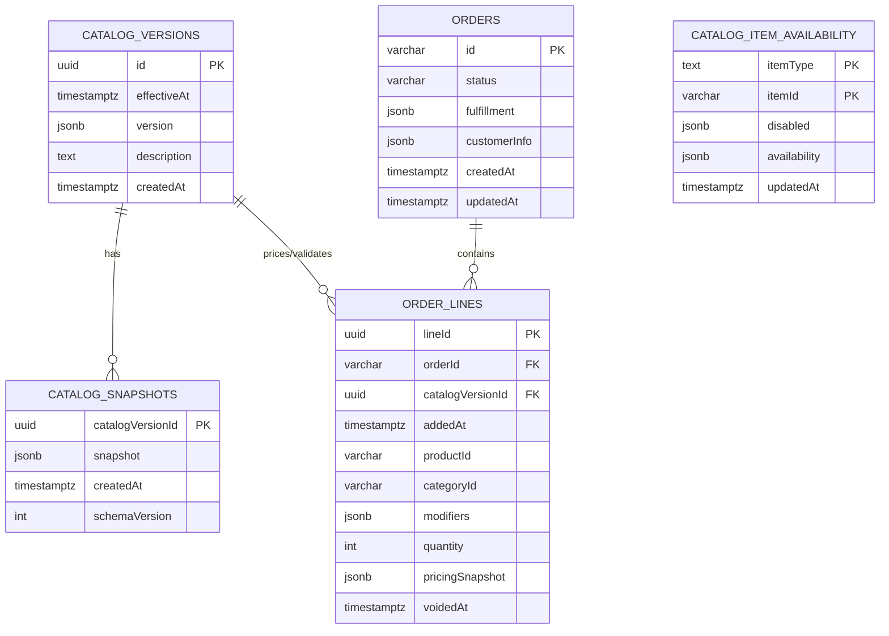
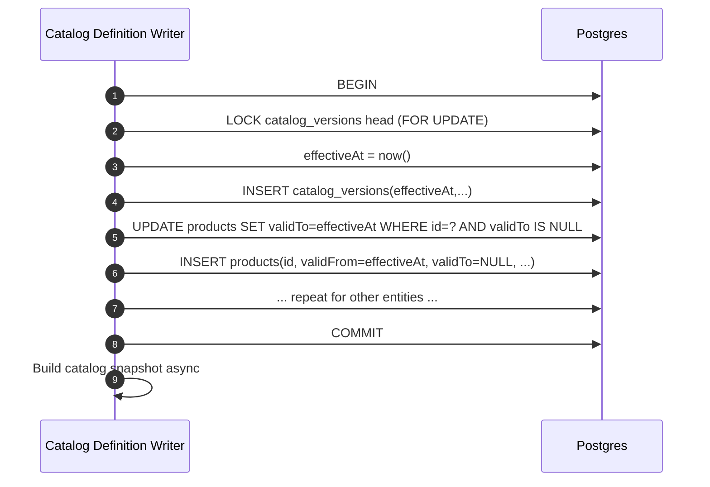
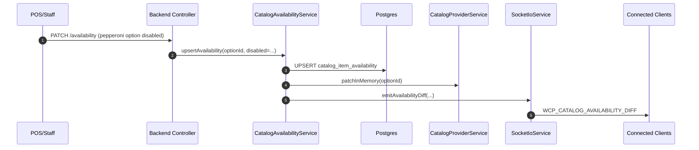

# Catalog Versioning + Operational Availability Architecture (Per‑Line Orders)

> **Status**: Proposed (ready to implement)  
> **Last updated**: 2025-12-13  
> **Applies to**: `wario-monorepo/apps/wario-backend` (NestJS + Postgres + TypeORM)  
> **Environment**: single location, single restaurant timezone (restaurant time is source of truth)

## Scope (Problem, Users, Success)

**Problem statement**: Serve a fast, live “current menu” while ensuring each _order line_ is validated and priced against the catalog **definition** and operational availability state that were current when that line was added—without retroactively changing existing lines.

**Primary users**

- Kitchen lead / manager 86’ing items during rush; needs safe, fast updates.
- Guests browsing the menu and ordering (web/menu).
- POS staff creating/modifying in‑progress and future orders.
- Staff viewing historical receipts.

**Success metrics**

- p95 “current menu” reads served from memory (no DB round trip).
- Availability/86 updates propagate to connected clients < 1s.
- Order line add p95 < 300ms with server-side validation.
- Receipts never drift: what was charged remains reconstructable without re-running current logic.

---

## Inventory (What This Document Defines)

**Components**

- Catalog **definition** storage (SCD2-capable tables via `TemporalEntity`).
- Catalog **definition versions** (`catalog_versions`) and **snapshots** (`catalog_snapshots`).
- Operational availability (“86” + schedules) as **current state** (`catalog_item_availability`) with an in-memory overlay.
- Orders with **per-line versioning** (`lineId`, `catalogDefinitionVersionId`, pricing snapshot).
- In-memory caches and Socket.IO live update contracts.

**Flows**

- Definition edit → atomic SCD2 write → new catalog version → snapshot build → notify clients.
- Availability/86 edit → update operational availability table → patch in-memory overlay → notify clients (no catalog recompute).
- Add order line → choose evaluation time → validate against current overlay + definition → price/name snapshot → persist.
- Read historical receipt → render from stored snapshots/totals (no drift).

**States**

- Cache warm/cold; snapshot missing; overlay stale; DB unavailable; order locked/unlocked; line voided/edited.

**Config tokens**

- `HISTORY_CACHE_WINDOW_DAYS` (suggest: 7–14)
- `CATALOG_SNAPSHOT_LRU_MAX_VERSIONS` (suggest: 100–300)
- `AVAILABILITY_PATCH_BATCH_MS` (debounce availability broadcasts, suggest: 50–250ms)
- `DEEP_HISTORY_THROTTLE_DAYS` (suggest: 14+)

---

## Glossary (Explicit Definitions)

### Catalog definition

The relatively stable structure and pricing rules of the menu:

- Products, product instances, options, option types, categories, functions, printer groups.
- Prices: product base price + selected option prices.
- Relationships: `Category.products`, `Product.instances`, `OptionType.options` (ordered ID arrays).

**Definition changes are rare** and are versioned immutably.

### Operational availability (86 + schedules)

The fast-changing “is this sellable right now / at service time?” state.

In this system:

- `disabled` and `availability` on products/options are treated as **operational controls** (86 and scheduling) and are persisted as **current state only** (no history).
- Operational updates must **not** create new catalog definition versions.
- Operational updates must **not** retroactively invalidate existing order lines (we do not revalidate old lines when an order is modified).

**Concrete representation (important)**

- `disabled` is an `IWInterval` interpreted against epoch time (`Date.now()` ms):
  - **Blanket 86**: `start > end` (see `BLANKET_DISABLED_INTERVAL` in `packages/wario-shared/src/lib/common.ts`)
  - **Timed disable**: `start <= now <= end`
- `availability` is `IRecurringInterval[]` evaluated by `DisableDataCheck(...)` (supports both “simple interval” and `rrule` recurrence).

### Catalog definition version

An immutable identifier for a point-in-time definition snapshot, created only when definition data changes.

### Order line

A stable unit of purchase that must not be reinterpreted when the catalog changes.

---

## Architecture Skeleton (Overview → Interfaces → Behavior → Examples)

### Overview

We split the system into two “planes”:

1. **Definition plane (immutable, versioned)**  
   Backed by SCD2 tables + `catalog_versions` + `catalog_snapshots`.

2. **Operational plane (mutable, current-state)**  
   Backed by `catalog_item_availability` and an in-memory overlay that patches the in-memory definition catalog before serving “current menu” and validating new lines.

### Interfaces / parameters

- **Definition version selectors**: `getCatalogSelectors(versionId)` returns `ICatalogSelectors` for that definition version (from memory for current, from snapshot cache for historical).
- **Availability overlay**: `getAvailabilityOverrides()` returns current `disabled` + `availability` overrides for `{product|option}` ids.
- **Order line identity**: `lineId` is required to support per-line versioning and non-retroactive updates.

### Behavior (high level)

- **Current menu**: in-memory definition catalog + in-memory overlay → returned/emitted without DB.
- **Historical catalog**: read snapshot by `catalogVersionId` → build selectors → used only for order interpretation/audit as needed.
- **Order changes**: only newly added lines are validated against _current_ operational availability; existing lines are not revalidated.

### Examples

- Preorder for next Thursday 5pm: add item now → validated using service time (5pm) but current availability settings; later add item at 2am Thu → new item validated using service time (5pm) but current availability settings at 2am; original line unchanged.
- Price changes mid-week: old line keeps old price snapshot; new line uses new definition version.

---

## System Diagram (Components)

```mermaid
flowchart LR
  subgraph Clients
    POS[wario-pos]
    MENU[wario-fe-menu]
  end

  subgraph Backend[wario-backend]
    API[REST Controllers]
    OMS[OrderManagerService\n(locking + mutations)]
    OVS[OrderValidationService\n(rebuild/validate)]
    CPS[CatalogProviderService\n(in-memory ICatalog)]
    AVS[CatalogAvailabilityService\n(current-state 86/schedule)]
    CVS[CatalogVersioningService\n(definition versions)]
    SSS[CatalogSnapshotService\n(version snapshots)]
    WS[SocketIoService\n(nsRO broadcasts)]
  end

  subgraph Postgres
    SCD2[(SCD2 catalog tables\nproducts/options/...\nvalidFrom/validTo)]
    CV[(catalog_versions)]
    CS[(catalog_snapshots)]
    OA[(catalog_item_availability\ncurrent state)]
    ORD[(orders + order_lines)]
  end

  POS -->|HTTP| API
  MENU -->|HTTP| API
  POS <-->|Socket.IO| WS
  MENU <-->|Socket.IO| WS

  API --> OMS
  API --> CPS
  OMS --> OVS
  OMS --> CVS
  OMS --> AVS
  OVS --> CPS
  CPS --> SCD2
  CVS --> CV
  SSS --> CS
  AVS --> OA
  OMS --> ORD

  CVS --> SSS
  CPS --> WS
  AVS --> WS
```

---

## Data Model (Explicit Tables and Invariants)

### 1) SCD2 catalog tables (definition plane)

Already present via `TemporalEntity` (see `apps/wario-backend/src/entities/base/temporal.entity.ts`).

**Invariant (definition plane):**

- For each logical `id`, there is exactly one “current row” where `validTo IS NULL`.
- Definition edits must be written atomically so readers never observe a gap.

> Note: We keep ordered ID arrays (`Category.products`, `Category.children`, `Product.instances`, `OptionType.options`). We are explicitly not normalizing these into join tables because the definition plane is versioned and time-travelled.

### 2) `catalog_versions` (definition version markers)

Already present (`apps/wario-backend/src/entities/catalog/catalog-version.entity.ts`).

**Rule:**

- A new row is inserted **only** when definition data changes (prices, names, structure, functions, etc).
- Operational availability changes do **not** insert a new catalog version.

### 3) `catalog_snapshots` (definition snapshots for fast as-of)

**New table** (proposed):

- `catalogVersionId uuid PRIMARY KEY REFERENCES catalog_versions(id)`
- `snapshot jsonb NOT NULL` (full `ICatalog`)
- `createdAt timestamptz NOT NULL DEFAULT now()`
- `schemaVersion int NOT NULL` (for future compatibility)

**Rule:**

- Snapshots are built once per definition version (async is fine).
- Historical “as-of” reads use snapshots, not N temporal joins.

### 4) `catalog_item_availability` (operational plane, current state only)

**New table** (proposed):

- `itemType text NOT NULL` (`'product' | 'option'`)
- `itemId varchar(36) NOT NULL`
- `disabled jsonb NULL` (IWInterval|null)
- `availability jsonb NOT NULL DEFAULT '[]'` (IRecurringInterval[])
- `updatedAt timestamptz NOT NULL DEFAULT now()`
- `updatedBy varchar NULL` (optional)
- `PRIMARY KEY (itemType, itemId)`

**Source-of-truth rule:**

- This table is the authoritative source for `disabled` and `availability` for products/options.
- The corresponding columns in definition tables are treated as legacy/baseline inputs and may be ignored/overwritten in memory.

**No history requirement:**

- We keep only current state. If you need audit later, add an events table separately.

### 5) Orders with per-line versioning

**Target (preferred) shape:**

`orders`

- header fields (customer, fulfillment, status, etc)

`order_lines`

- `lineId uuid PRIMARY KEY`
- `orderId varchar(36) NOT NULL REFERENCES orders(id)`
- `addedAt timestamptz NOT NULL`
- `catalogVersionId uuid NOT NULL REFERENCES catalog_versions(id)` (definition version at add-time)
- `productId varchar(36) NOT NULL`
- `categoryId varchar(36) NOT NULL`
- `modifiers jsonb NOT NULL` (ProductInstanceModifierEntry[])
- `quantity int NOT NULL`
- `pricingSnapshot jsonb NOT NULL` (see “Pricing Snapshot”)
- `voidedAt timestamptz NULL` and `voidReason text NULL` (optional)

**Minimum:**

- If you cannot introduce `order_lines` yet, embed the same fields into `orders.cart` JSONB entries and migrate later.

---

## ER Diagram (At a Glance)



---

## Consistency and Locking (How We Avoid Impossible States)

### Definition writes must be atomic

Gap-read example to avoid:

1. Close old SCD2 row (`validTo = now`)
2. Order reads at `now + 1ms` → sees nothing current
3. Insert new row (`validFrom = now + 2ms`)

**Required pattern**

- All SCD2 updates for a definition change happen in a single DB transaction with a single `effectiveAt`.
- The transaction inserts the new `catalog_versions` row and uses its `effectiveAt` for all row closures/inserts.



### Order line adds must read a consistent definition version

To ensure per-line versioning is correct:

- The order-line add flow reads the current `catalogVersionId` once and stores it on the line.
- It uses that version’s _definition_ selectors to compute price/name snapshot.

If definition writes use the atomic pattern above, line adds can read the latest committed version without heavy locking. If you want stricter guarantees, a `FOR SHARE` lock on the latest `catalog_versions` row is acceptable.

---

## Service Time Semantics (Availability Evaluation Time)

Availability checks are always computed in **restaurant local time**.

### Definitions

- `nowLocal`: “what the restaurant clock reads now”.
- `fulfillmentLocal`: the fulfillment target time for this order (e.g., “next Thu at 5pm local”), computed from `fulfillment.selectedDate` + `selectedTime`.

### Rule: evaluation time for validating newly added lines

- **Scheduled/preorder**: validate using `fulfillmentLocal`.
- **Live/immediate ordering**: validate using `nowLocal`.

### Rule: existing lines are not revalidated

When an order is modified (e.g., add/remove/void lines), we do **not** revalidate existing lines against current availability settings. We only validate newly added lines.

This matches the requirement:

- “Adding items later should not retroactively change already-ordered items.”

### Implementation note

Today, `OrderValidationService.RebuildOrderState(...)` uses a passed `service_time`. Under this architecture:

- For “validate newly added lines”, pass `evaluationTime` as defined above.
- For “validate the entire order” (rare; e.g., fulfillment time changed), run a separate policy path (see below).

### Fulfillment change policy (explicit)

If the fulfillment date/time of an open order is changed:

- **Do not auto-delete lines**.
- **Do re-run validation** against the new `fulfillmentLocal` and return “needs confirmation” warnings for any lines that would now be invalid for the new service time.

This keeps history stable while preventing silent invalid orders.

---

## Line Snapshot (Receipts Must Not Drift, Ops Must Be Stable)

Even with per-line `catalogVersionId`, receipts must not depend on re-running code that can change over time (tax rounding changes, bug fixes, etc.).

### What we store

This architecture uses a per-line “snapshot” payload stored on the line. It serves two purposes:

- **Receipts/accounting stability** (never drift)
- **Operational stability** for downstream systems that should not depend on today’s catalog (printing, KDS routing, etc.)

**Per-line `pricingSnapshot` (minimum for receipts/accounting)**

- `displayName` (what prints)
- `currency`
- `unitBasePrice` (product base)
- `unitModifiersPrice` (sum of option prices)
- `unitPrice` (= base + modifiers)
- `quantity`
- `extendedPrice` (= unitPrice \* quantity)

**Per-line operational fields (recommended)**

- `printerGroupId` (so tickets don’t depend on current `product.printerGroup`)
- `taxRateApplied` (or `taxCategory`) if tax logic can evolve

**Per-order stored totals (at commit/payment time)**

- `subtotal`, `discountTotal`, `taxTotal`, `tipTotal`, `total`
- enough to reprint receipts without recomputation

### How we compute it

Compute via the same logic used today for cart rebuild/metadata:

- base product price + modifier option prices (see `WCPProductGenerateMetadata` in `packages/wario-shared/src/lib/objects/WCPProduct.ts`)

### What we do NOT store

- Availability “reason at add time” (explicitly not required).

---

## Operational Availability (86 + Schedule) Design

### Storage

We persist **only current state** in `catalog_item_availability`.

### In-memory overlay

`CatalogProviderService` continues to hold the current in-memory definition `ICatalog`, but before serving/emitting it:

- Patch `product.disabled/product.availability` and `option.disabled/option.availability` from the overlay table.
- This keeps `wario-shared` selection/validation logic unchanged.

### Update API behavior

An operational availability update (disable/enable/change schedule) should:

1. write `catalog_item_availability` (upsert)
2. patch the in-memory catalog objects (O(1) per id)
3. broadcast updates to clients

**No full catalog recompute** is required.

### API contract strategy (DTOs unchanged, behavior changes)

The public API shape (and `wario-shared` DTOs) already include:

- `IProduct.disabled`, `IProduct.availability`
- `IOption.disabled`, `IOption.availability`

We keep that contract **unchanged**, but we change _where those fields are written_:

**Rule**

- Any API mutation that includes `disabled` or `availability` writes those fields to `catalog_item_availability`, not to the definition SCD2 tables.
- The definition SCD2 tables remain the source of truth for everything else (names, prices, relationships, etc).

**Practical controller behavior**

- For endpoints like `PATCH /api/v1/menu/product/:pid` and `PATCH /api/v1/menu/modifier/option/:oid`:
  - Split the payload into:
    - `definitionPatch = body minus { disabled, availability }`
    - `availabilityPatch = { disabled?, availability? }` (only if provided)
  - Apply `definitionPatch` using existing catalog definition services (this may create a new catalog definition version if non-empty).
  - Apply `availabilityPatch` using `CatalogAvailabilityService` (never creates a definition version).

**Creation behavior**

- When creating a new product/option, persist its initial `disabled/availability` into `catalog_item_availability` as well, so subsequent changes remain operational.

**Backfill**

- One-time migration: for each current product/option row, copy `disabled/availability` into `catalog_item_availability` if no row exists yet.
- After backfill, treat SCD2 `disabled/availability` columns as legacy/baseline (ignored once an overlay exists).



### Client update contract (Socket.IO)

Current system emits full catalog via `WCP_CATALOG`.

**Recommended additions**

- `WCP_CATALOG_DEFINITION_VERSION`: `{ catalogVersionId, effectiveAt }`
- `WCP_CATALOG_AVAILABILITY_DIFF`: `{ items: [{ itemType, itemId, disabled, availability }] }`

**Compatibility path**

- Initially, keep emitting `WCP_CATALOG` on operational changes (from memory) for zero client changes.
- Add diff event later and migrate clients to patch locally.

---

## Per‑Line Versioning (Order Model)

### Why per-line (not per-order)

An order can evolve over time (add another round). Each new line must use the current definition version (for price/name), while existing lines remain unchanged.

### Required line semantics

- Each line has a stable `lineId`.
- Lines are immutable for meaning-changing edits:
  - Changing product/modifiers should be represented as: `void old line` + `add new line`.
  - Quantity change may be allowed as an in-place update **if** you accept that it changes extended price; otherwise also model as a delta line.

### Line add algorithm (explicit)

1. Determine `evaluationTime`:
   - preorder → `fulfillmentLocal`
   - live → `nowLocal`
2. Read `currentCatalogVersionId` (definition version) from memory or DB.
3. Validate the requested line:
   - uses definition selectors + current operational overlay at `evaluationTime`
4. Compute `pricingSnapshot` using definition selectors for `currentCatalogVersionId`.
5. Persist line with `catalogVersionId = currentCatalogVersionId`.
6. Return updated order; do not revalidate old lines.

```mermaid
flowchart TD
  A[Client requests add line] --> B[Compute evaluationTime]
  B --> C[Read currentCatalogVersionId]
  C --> D[Validate availability at evaluationTime\n(definition + overlay)]
  D -->|valid| E[Compute pricingSnapshot\n(definition selectors)]
  D -->|invalid| X[Reject add]
  E --> F[Persist order line\n(lineId + catalogVersionId)]
  F --> G[Return updated order]
```

---

## Caching Strategy (Optimized for Current Week)

### In-process caches

- **Current definition catalog**: `ICatalog` + selectors (single instance).
- **Operational overlay map**: `{ productId|optionId -> {disabled, availability} }`.
- **Historical snapshot LRU**: keyed by `catalogVersionId`, TTL 7–14 days.

### DB caches

- `catalog_snapshots` serves as the durable cache for historical catalogs.

### Throttling deep history

If historical access becomes a bottleneck:

- throttle “catalog as-of” reads older than `DEEP_HISTORY_THROTTLE_DAYS`
- prefer serving current menu traffic

---

## Implementation Map (Where This Lands in the Repo)

This section is intentionally explicit so implementation can follow directly.

### New database tables (TypeORM migrations)

Create migrations under `apps/wario-backend/src/migrations/`:

- `catalog_snapshots`
- `catalog_item_availability`
- `order_lines` (if you choose normalized lines now)

### New entities

Add TypeORM entities:

- `apps/wario-backend/src/entities/catalog/catalog-snapshot.entity.ts` → `catalog_snapshots`
- `apps/wario-backend/src/entities/catalog/catalog-item-availability.entity.ts` → `catalog_item_availability`
- `apps/wario-backend/src/entities/order/order-line.entity.ts` → `order_lines` (optional in first rollout)

Register these entities in:

- `apps/wario-backend/src/repositories/repository.module.ts` (entities list)

### New services (NestJS providers)

Add providers (under `apps/wario-backend/src/config/`):

- `catalog-versioning/`
  - `CatalogVersioningService`: “current catalog definition version id”, creates new versions for definition writes, exposes `getCurrentVersion()`.
- `catalog-snapshots/`
  - `CatalogSnapshotService`: builds and loads `catalog_snapshots`, provides `getSelectorsForVersion(versionId)`.
- `catalog-availability/`
  - `CatalogAvailabilityService`: loads `catalog_item_availability` on boot, upserts updates, patches the in-memory catalog, emits Socket.IO diffs.

### Modifications to existing services

- `apps/wario-backend/src/config/catalog-provider/catalog-provider.service.ts`
  - Track `currentCatalogVersionId`.
  - Load definition catalog from SCD2 tables (as today).
  - Apply operational overlay after load (and on updates).
  - Provide helpers: `patchProductAvailability(id, patch)` / `patchOptionAvailability(id, patch)`.
- `apps/wario-backend/src/config/socket-io/socket-io.service.ts`
  - Emit new events:
    - `WCP_CATALOG_DEFINITION_VERSION`
    - `WCP_CATALOG_AVAILABILITY_DIFF`
- `apps/wario-backend/src/config/order-manager/order-manager.service.ts`
  - On “add line”, compute evaluation time, validate only the new line, create `lineId`, compute and persist `pricingSnapshot`, store `catalogVersionId` on the line.
  - Do not revalidate old lines on mutation.
- `apps/wario-backend/src/config/printer/printer.service.ts`
  - Prefer line snapshot fields (`displayName`, `printerGroupId`) over rebuilding cart from current catalog where possible.

### Controller strategy (no DTO break)

Existing endpoints that mutate products/options (e.g., `apps/wario-backend/src/controllers/product/product.controller.ts`) can keep the same DTOs, but must:

- Split `disabled`/`availability` from the request body and route those fields to `CatalogAvailabilityService`.
- Treat remaining fields as definition edits (may create a new catalog definition version).

---

## Roadmap (From Current Codebase to Target)

### Phase 0 — Document and align (1–2 days)

- Confirm line immutability policy (“void + add” for modifier changes).
- Confirm client adoption plan for `lineId` and per-line fields.

### Phase 1 — Catalog definition versioning becomes real (1–2 weeks)

- Ensure every definition write produces a new `catalog_versions` row and uses a single `effectiveAt` for SCD2 updates.
- Ensure no-gap atomicity via transactions + lock pattern.
- Track `currentCatalogVersionId` in `CatalogProviderService`.

### Phase 2 — Add `catalog_snapshots` + selector lookup by version (1–2 weeks)

- Add the `catalog_snapshots` table + builder job.
- Implement `getCatalogSelectors(versionId)`:
  - current → in-memory
  - historical → LRU → DB snapshot → reconstruct (rare)

### Phase 3 — Implement operational availability current-state (1–2 weeks)

- Add `catalog_item_availability` table.
- Add `CatalogAvailabilityService`:
  - load overlay on boot
  - upsert availability updates
  - patch in-memory catalog objects
  - emit Socket.IO diff events
- Route staff “86 / schedule edits” to this service (not definition edits).

### Phase 4 — Per-line order model (2–6 weeks; depends on frontend rollout)

- Add `lineId` + per-line `catalogVersionId` + `pricingSnapshot`.
- Implement “do not revalidate old lines” logic.
- Backfill existing orders with synthetic `lineId`s and inferred `catalogVersionId` (use “order created at” version as best-effort).

### Phase 5 — Receipt hardening (ongoing)

- Persist order totals at commit/payment time.
- Add monitoring: cache hit rate, snapshot build latency, availability propagation latency.

---

## Known Limitations (Explicit)

- Operational availability is current-state only: you cannot answer “was pepperoni disabled last Tuesday?” without adding an events table later.
- If fulfillment time changes, the system warns but does not auto-remove lines; staff must resolve.

---

## Handoff Checklist (Definition of Done)

- Title/breadcrumb/env badge present (top of this doc).
- Clear separation of definition vs operational availability.
- Per-line versioning rules written and stable line IDs required.
- Service-time evaluation rules explicit (preorder vs live).
- Data model tables and invariants specified.
- Socket.IO event contracts specified.
- Roadmap with phases and deliverables included.
