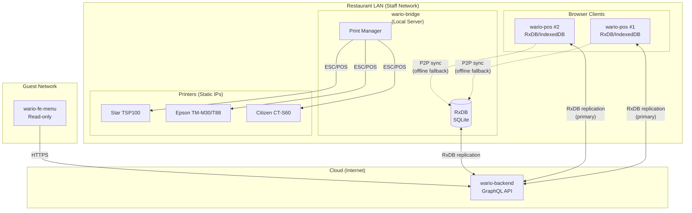
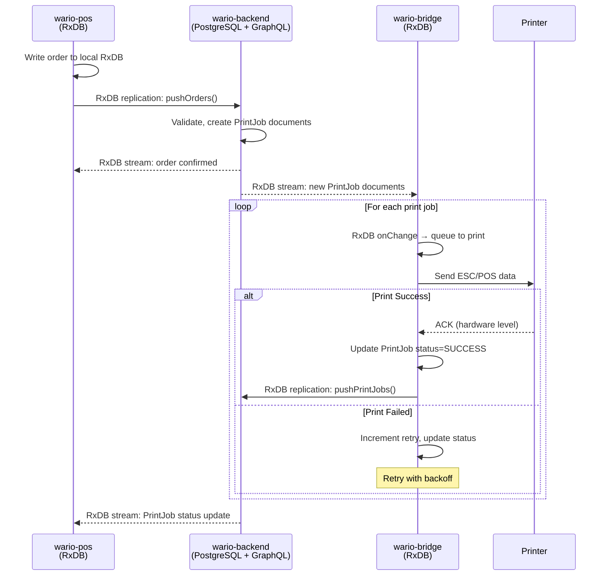
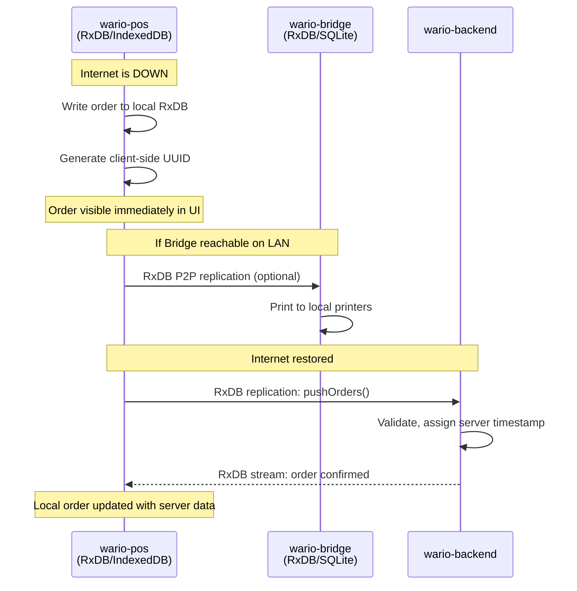
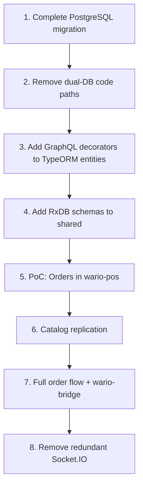
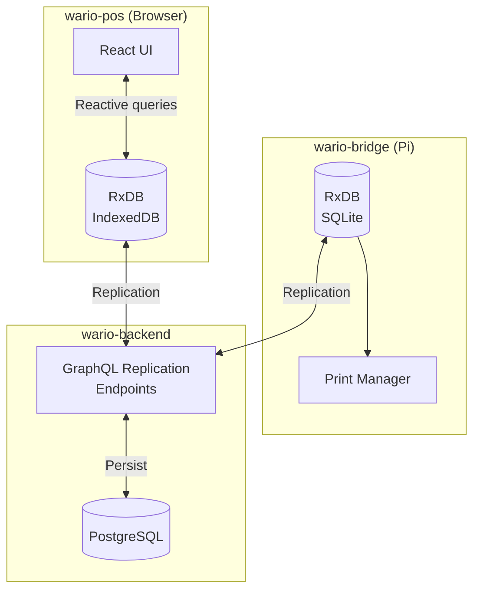
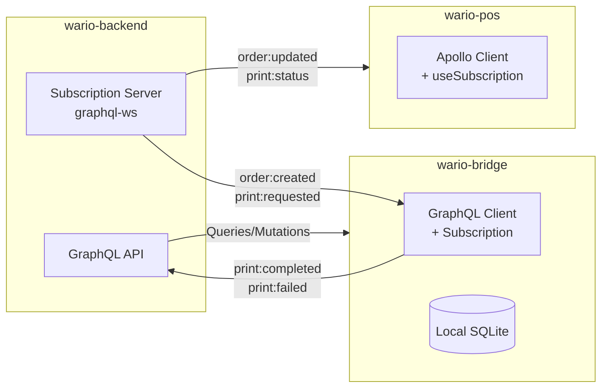

# Order Flow Architecture Design

## Overview

This document proposes an architecture for reliable order flow at the restaurant, addressing:

- **Thermal/impact printer integration** via multiple manufacturers (Star, Epson)
- **Kitchen Display System (KDS)** foundation for future tablet displays
- **wario-bridge** local service for LAN communication
- **Mission-critical print verification** with guaranteed delivery confirmation
- **Offline resilience** for wario-pos clients during internet outages

## Current State Analysis

### Existing Infrastructure

| Component      | Current Implementation                                                    |
| -------------- | ------------------------------------------------------------------------- |
| Printing       | Square workaround via dummy location + Square KDS tablet                  |
| Real-time      | Socket.IO gateway (`nsRO` namespace) for catalog/settings                 |
| Printer Config | `PrinterGroup` entity with `isExpo`, `singleItemPerTicket`, `externalIDs` |
| Order Events   | Not currently broadcast via socket                                        |

### Pain Points

1. **Square Dependency**: Printing relies on Square's KDS which is unreliable for timing-critical operations
2. **No Direct Printer Control**: Can't verify print completion or detect paper-out conditions
3. **Single Point of Failure**: Internet outage breaks order flow entirely
4. **No KDS Foundation**: Future KDS displays have no architecture to build on

---

## Proposed Architecture

> [!IMPORTANT]
> **Primary path**: wario-pos ↔ wario-backend (cloud)  
> **Fallback path**: wario-pos ↔ wario-bridge (LAN, when backend unreachable)  
> **Bridge purpose**: Print job execution + offline sync peer (NOT a backend proxy)



### Network Topology

| Network        | Devices                           | Access to Bridge             |
| -------------- | --------------------------------- | ---------------------------- |
| **Staff LAN**  | wario-pos, wario-bridge, printers | ✅ Full access               |
| **Guest WiFi** | wario-fe-menu, customers          | ❌ No access                 |
| **Internet**   | wario-backend                     | ✅ Bridge initiates outbound |

> [!NOTE]
> **Guest Network Policy**: wario-fe-menu fetches from wario-backend only. No bridge access for guest network—menu viewers can tolerate brief outages, and this simplifies security.

---

## Component Responsibilities

### 1. wario-backend (Cloud)

Remains the **source of truth** for orders and business logic.

| Responsibility       | Description                                      |
| -------------------- | ------------------------------------------------ |
| Order API            | Create, update, cancel orders via GraphQL        |
| GraphQL Replication  | Provide pull/push/stream endpoints for RxDB sync |
| Print Job Management | Store print jobs; wario-bridge syncs via RxDB    |
| Catalog/Settings     | Serve via GraphQL for RxDB replication           |

**GraphQL Endpoints (for RxDB replication):**

```graphql
type Query {
  pullOrders(checkpoint: CheckpointInput, limit: Int!): OrderPullBulk!
  pullPrintJobs(checkpoint: CheckpointInput, limit: Int!): PrintJobPullBulk!
}

type Mutation {
  pushOrders(rows: [OrderInput!]!): [Order!]!
  pushPrintJobs(rows: [PrintJobInput!]!): [PrintJob!]! # Bridge reports status
}

type Subscription {
  streamOrders(headers: JSON): OrderPullBulk!
  streamPrintJobs(headers: JSON): PrintJobPullBulk!
}
```

---

### 2. wario-bridge (LAN Server)

A new NestJS application running on a dedicated small computer on the LAN.

| Responsibility   | Description                                        |
| ---------------- | -------------------------------------------------- |
| Cloud Sync       | Maintain connection to wario-backend via RxDB      |
| Print Queue      | Local SQLite queue for print jobs with retry logic |
| Printer Config   | Store printer IPs from configuration (static IPs)  |
| Print Execution  | Send ESC/POS data to printers                      |
| Status Reporting | Report print success/failure back to wario-backend |
| Local Relay      | Serve order events to wario-pos clients on LAN     |
| Offline Cache    | Cache catalog/settings for offline operation       |

**Print Queue Schema:**

```sql
CREATE TABLE print_jobs (
  id TEXT PRIMARY KEY,           -- UUID from wario-backend
  created_at DATETIME,
  status TEXT,                   -- PENDING, IN_PROGRESS, SUCCESS, FAILED, CANCELED
  printer_id TEXT,               -- Target printer
  content BLOB,                  -- ESC/POS commands or raw text
  retry_count INTEGER DEFAULT 0,
  last_attempt DATETIME,
  error_message TEXT,
  order_id TEXT                  -- Reference to wario order
);
```

**Retry Strategy:**

```
Attempt 1: Immediate
Attempt 2: +5 seconds
Attempt 3: +15 seconds
Attempt 4: +60 seconds
Attempt 5: +5 minutes (then FAILED, alert)
```

---

### 3. wario-pos (Browser Client)

Modifications to support dual-path connectivity.

| Mode         | Primary Path            | Fallback Path            |
| ------------ | ----------------------- | ------------------------ |
| **Online**   | Direct to wario-backend | —                        |
| **Degraded** | wario-bridge (LAN)      | Queue mutations for sync |
| **Offline**  | Local cache only        | Queue mutations for sync |

**Connection Priority:**

```typescript
enum ConnectionMode {
  CLOUD_DIRECT, // Internet available, full functionality
  BRIDGE_RELAY, // Internet down, LAN relay via bridge
  OFFLINE_CACHED, // No connectivity, read-only with queued writes
}
```

> [!IMPORTANT]
> **Offline Mode Scope**: During offline operation, wario-pos can:
>
> - View cached catalog and settings
> - Create orders (queued for later sync)
> - View locally cached order history
>
> But **cannot**:
>
> - Process payments (requires Square)
> - Receive real-time updates from other terminals

---

### 4. Printer Configuration (Enhanced)

Extend `PrinterGroup` to support direct printer addressing.

**New Fields:**

```typescript
interface PrinterConfig {
  id: string;
  name: string;

  // Existing
  singleItemPerTicket: boolean;
  isExpo: boolean;
  externalIDs: KeyValue[]; // Square IDs for legacy

  // NEW: Direct printing
  printerType: 'THERMAL_RECEIPT' | 'THERMAL_LABEL' | 'IMPACT';
  connectionType: 'NETWORK' | 'USB';
  networkAddress?: string; // IP or hostname for NETWORK type
  driverProtocol: 'ESCPOS' | 'STAR' | 'RAW_TEXT';
  paperWidth: 80 | 58 | 44; // mm

  // NEW: Routing
  printRules: PrintRule[]; // When to print to this printer
}

interface PrintRule {
  triggerEvent: 'ORDER_CREATED' | 'ORDER_SENT' | 'ORDER_CANCELED' | 'TIME_CHANGE';
  fulfillmentTypes?: string[]; // Filter by fulfillment
  categoryIds?: string[]; // Filter by product category
  printTemplate: string; // Template ID
}
```

---

## Data Flow Diagrams

### Order Creation → Print (with RxDB)



### Offline Order Creation (with RxDB)



> [!TIP]
> **Key Difference with RxDB**: Orders are written locally first, then replicated. There's no "temp ID" - client generates a UUID that becomes the permanent ID.

---

## KDS Foundation (DEFERRED)

> [!NOTE]
> KDS development is deferred, but the RxDB architecture naturally supports it.

### How KDS Would Work with RxDB

```typescript
// KDS connects to wario-bridge and subscribes to order collection
import { useRxCollection and useRxQuery } from 'rxdb-hooks';

interface KDSConfig {
  stationId: string;  // Maps to printerGroup
  displayCategories: string[];
  showFulfillmentTypes: string[];
}

// KDS uses reactive queries on the orders collection
const ordersQuery = ordersCollection.find({
  selector: {
    status: { $in: ['OPEN', 'CONFIRMED'] },
    'cart.printerGroup': kdsConfig.stationId,
  },
});

// UI updates automatically when orders change
ordersQuery.$.subscribe(orders => {
  // Render tickets
});
```

**Benefits of RxDB for KDS:**

- No explicit event system needed - reactive queries handle updates
- KDS can work offline with locally replicated data
- Same codebase pattern as wario-pos

---

## Failure Modes & Recovery

| Failure                  | Detection                 | Impact                         | Recovery                                   |
| ------------------------ | ------------------------- | ------------------------------ | ------------------------------------------ |
| **Printer offline**      | Print timeout             | Jobs queue on bridge           | Retry with backoff; alert after 5 failures |
| **Printer out of paper** | Status query (Star/Epson) | Jobs queue                     | Alert POS; wait for refill                 |
| **Bridge offline**       | RxDB replication timeout  | POS falls back to cloud-direct | Auto-reconnect; RxDB syncs on restore      |
| **Internet down**        | RxDB replication fails    | POS uses local RxDB cache      | RxDB syncs when connection restored        |
| **Backend offline**      | Health check fail         | Critical - payment blocked     | POS shows degraded mode; cash only         |

### Print Job Status Dashboard

wario-pos should display:

- Real-time print queue status
- Failed jobs with error messages
- Manual "retry all" / "cancel" actions
- Printer health indicators (online/offline/paper-out)

---

## Security Considerations

| Concern                | Mitigation                                           |
| ---------------------- | ---------------------------------------------------- |
| LAN-only bridge access | Bind to LAN interface only; firewall external access |
| Bridge authentication  | Shared secret in env vars; optional mTLS             |
| Print data sensitivity | No PII logging; encrypt SQLite at rest               |
| POS→Bridge auth        | Same auth token as backend; bridge validates         |

---

## Technology Choices

### Hardware Specifications (Confirmed)

| Component            | Specification                                                |
| -------------------- | ------------------------------------------------------------ |
| **Bridge Computer**  | Raspberry Pi 5 or equivalent SBC running Linux               |
| **Thermal Printers** | Star TSP100 series, Epson TM-M30 series, Epson TM-T88 series |
| **Impact Printers**  | Citizen CT-S60 (ESC/POS compatible)                          |
| **Network**          | Static IP assignment for all printers                        |

### Software Stack

| Component            | Technology                | Rationale                                       |
| -------------------- | ------------------------- | ----------------------------------------------- |
| wario-bridge runtime | NestJS on Node.js 20 LTS  | Consistency with backend; ARM64 support         |
| Print queue          | SQLite (`better-sqlite3`) | Embedded, reliable, no external deps            |
| Printer protocol     | `escpos` npm package      | All target printers support ESC/POS             |
| WebSocket            | Socket.IO                 | Consistency with backend; fallback support      |
| Process manager      | PM2                       | Auto-restart, log rotation, systemd integration |

> [!NOTE]
> **ESC/POS Universal**: All specified printers (Star TSP100, Epson TM-M30/T88, Citizen CT-S60) support ESC/POS protocol, simplifying the driver layer significantly. No need for manufacturer-specific SDKs.

---

## Implementation Phases

> [!IMPORTANT]
> **Phases reordered** per the RxDB Preparation Roadmap. PostgreSQL migration must complete before GraphQL/RxDB work.

### Phase 0: PostgreSQL Migration (BLOCKING)

- [ ] Ensure `USE_POSTGRES=true` is production-ready
- [ ] Complete TypeORM entity coverage
- [ ] Remove dual-database code paths

### Phase 1: GraphQL + wario-bridge MVP

- [ ] Add `@nestjs/graphql` to wario-backend
- [ ] Add GraphQL decorators to TypeORM entities
- [ ] Create wario-bridge NestJS project
- [ ] Implement RxDB replication to wario-backend
- [ ] Implement SQLite print queue
- [ ] Implement ESC/POS printer driver

### Phase 2: RxDB in wario-pos

- [ ] Add RxDB to wario-pos (IndexedDB storage)
- [ ] Implement GraphQL replication
- [ ] Add connection mode detection (online/offline)
- [ ] Add print status display in POS UI

### ~~Phase 3: KDS Foundation~~ (DEFERRED)

---

## RxDB Preparation Roadmap

> [!IMPORTANT]
> The following outlines blocking changes and technical debt to address **before** implementing RxDB.

### Current State Summary

| Component          | Current State                                  | RxDB Requirement                   |
| ------------------ | ---------------------------------------------- | ---------------------------------- |
| **API**            | REST with TanStack Query                       | GraphQL with replication endpoints |
| **Backend DB**     | MongoDB → PostgreSQL (`USE_POSTGRES`)          | Any (RxDB replicates to GraphQL)   |
| **Frontend State** | Jotai (50+ files), Zustand (1 store)           | RxDB local collections             |
| **Real-time**      | Socket.IO (`nsRO` namespace)                   | RxDB replication stream            |
| **Schemas**        | DTOs (class-validator) + TypeScript interfaces | JSON Schema for RxDB               |

### Blocking Changes (Must Do First)

#### 1. Add GraphQL to wario-backend

RxDB's GraphQL replication requires specific endpoints:

```graphql
# Required for RxDB replication
type Query {
  # Pull: Get documents changed since checkpoint
  pullOrders(checkpoint: OrderCheckpointInput, limit: Int!): OrderPullBulk!
}

type Mutation {
  # Push: Write local changes to server
  pushOrders(rows: [OrderInput!]!): [Order!]!
}

type Subscription {
  # Stream: Real-time updates
  streamOrders(headers: JSON): OrderPullBulk!
}
```

**TypeORM + GraphQL Code Reuse (Code-First)**

> [!TIP]
> NestJS code-first GraphQL allows **combining TypeORM and GraphQL decorators on the same class**. Your existing TypeORM entities can serve triple duty:
>
> 1. PostgreSQL schema (TypeORM)
> 2. GraphQL API schema (@nestjs/graphql)
> 3. TypeScript types (existing interfaces)

**Example: Extending existing `OrderEntity`:**

```typescript
// BEFORE: TypeORM only (order.entity.ts)
@Entity('orders')
export class OrderEntity implements WOrderInstance {
  @PrimaryColumn({ type: 'varchar', length: 36 })
  id!: string;

  @Column({ type: 'varchar', length: 20 })
  status!: WOrderStatus;
}

// AFTER: TypeORM + GraphQL combined
import { Field, ID, ObjectType, registerEnumType } from '@nestjs/graphql';

registerEnumType(WOrderStatus, { name: 'WOrderStatus' });

@ObjectType() // ← GraphQL object type
@Entity('orders') // ← TypeORM entity (unchanged)
export class OrderEntity implements WOrderInstance {
  @Field(() => ID) // ← GraphQL field
  @PrimaryColumn({ type: 'varchar', length: 36 })
  id!: string;

  @Field(() => WOrderStatus) // ← GraphQL enum field
  @Column({ type: 'varchar', length: 20 })
  status!: WOrderStatus;

  @Field(() => CustomerInfoType) // ← Nested GraphQL type
  @Column('jsonb')
  customerInfo!: CustomerInfoData;
}
```

**Benefits of this approach:**

- Zero code duplication between DB schema and API schema
- Single source of truth for field definitions
- TypeORM relations map directly to GraphQL relations
- Existing entity tests continue to work

**Work Items:**

- [ ] Add `@nestjs/graphql` and `graphql` packages
- [ ] Use code-first approach (decorators on entities)
- [ ] Add `@ObjectType()` and `@Field()` decorators to key entities
- [ ] Create `OrderResolver` with pull/push/stream methods
- [ ] Create `CatalogResolver` for catalog replication (read-only)
- [ ] Add `graphql-ws` for subscriptions
- [ ] Ensure checkpoint-based pagination for pull queries

#### 2. Define RxDB-Compatible Schemas

RxDB uses JSON Schema. Need to derive from existing DTOs:

```typescript
// Current: class-validator DTO
export class WOrderInstanceDto {
  @IsString() @IsNotEmpty() readonly id!: string;
  @IsEnum(WOrderStatus) readonly status!: WOrderStatus;
  // ...
}

// NEW: JSON Schema for RxDB
export const orderSchema = {
  version: 0,
  primaryKey: 'id',
  type: 'object',
  properties: {
    id: { type: 'string', maxLength: 100 },
    status: { type: 'string', enum: ['OPEN', 'CONFIRMED', ...] },
    // ...
  },
  required: ['id', 'status', ...],
};
```

**Work Items:**

- [ ] Create `packages/wario-shared/src/lib/schemas/` directory
- [ ] Add `rxdb` schema definitions for: `orders`, `catalog`, `settings`
- [ ] Consider Zod-to-JSON-Schema conversion for consistency
- [ ] Ensure schemas work in both browser and Node

#### 3. Complete PostgreSQL Migration

RxDB replication works best with a stable backend. Complete the DB migration:

**Work Items:**

- [ ] Ensure `USE_POSTGRES=true` is production-ready
- [ ] Complete TypeORM entity coverage for all Mongoose models
- [ ] Remove dual-database code paths
- [ ] Update repository layer to TypeORM-only

### Technical Debt to Address

#### 1. Consolidate State Management (Medium Priority)

Current state is fragmented:

- **Jotai**: 50+ atoms across `src/atoms/` for UI state
- **Zustand**: 1 store for seating builder
- **TanStack Query**: REST API caching

**With RxDB:**

- RxDB collections become the local source of truth
- TanStack Query is no longer needed for RxDB-synced data
- Jotai/Zustand remain for ephemeral UI state only

**Work Items:**

- [ ] Identify which Jotai atoms hold server data vs. pure UI state
- [ ] Plan migration of server-data atoms to RxDB collections
- [ ] Keep Jotai for: dialog state, form state, selection state
- [ ] Keep Zustand for: complex multi-step wizards (seating builder)

#### 2. Remove Socket.IO for Synced Data (Low Priority)

Current Socket.IO emits:

- `WCP_CATALOG`, `WCP_SETTINGS`, `WCP_FULFILLMENTS`, `WCP_SEATING_RESOURCES`

With RxDB:

- These become RxDB collections with replication
- Socket.IO may remain for non-synced events (alerts, print status)

**Work Items:**

- [ ] Map current Socket.IO events to RxDB collections
- [ ] Keep Socket.IO for: print job status, alerts, bridge-specific events
- [ ] Remove redundant Socket.IO events after RxDB adoption

#### 3. Standardize ID Generation (Low Priority)

RxDB works best with predictable IDs. Currently:

- MongoDB `_id` (ObjectId)
- Some entities use UUID

**Work Items:**

- [ ] Audit ID formats across entities
- [ ] Consider UUID v7 (sortable) for new entities
- [ ] Ensure IDs are stable across sync

### RxDB Implementation Phases

#### Phase A: Proof of Concept (1-2 weeks)

- [ ] Add RxDB to wario-pos with a single collection (e.g., `orders`)
- [ ] Add GraphQL resolver for orders with pull/push
- [ ] Test replication round-trip
- [ ] Validate offline creation and sync

#### Phase B: Catalog Replication (1 week)

- [ ] Add read-only RxDB collections for catalog entities
- [ ] Replace `WCP_CATALOG` Socket.IO with RxDB replication
- [ ] Migrate `useCatalogSelectors` to RxDB queries

#### Phase C: Full Order Flow (2 weeks)

- [ ] Complete order collection with all fields
- [ ] Add print job tracking
- [ ] Integrate with wario-bridge
- [ ] Test multi-terminal conflict resolution

#### Phase D: wario-bridge Integration (1-2 weeks)

- [ ] Add RxDB to wario-bridge (Node.js + SQLite adapter)
- [ ] Bridge replicates relevant collections
- [ ] Bridge subscribes to print jobs via RxDB
- [ ] Implement print queue from RxDB documents

### Recommended Order of Work

> [!IMPORTANT]  
> **PostgreSQL migration must come first** since GraphQL decorators will be added to TypeORM entities.



### Type Sharing Strategy

> [!TIP]
> **Codegen may not be needed.** Since TypeORM entities already implement `wario-shared` interfaces (e.g., `OrderEntity implements WOrderInstance`), frontends can use these existing interfaces directly:
>
> ```typescript
> import type { WOrderInstance } from '@wcp/wario-shared/types';
> const ordersCollection: RxCollection<WOrderInstance> = ...;
> ```
>
> Consider codegen only if:
>
> - GraphQL adds computed fields not in original interfaces
> - You want auto-generated Apollo/urql query hooks

### Risk Assessment

| Risk                           | Mitigation                                                  |
| ------------------------------ | ----------------------------------------------------------- |
| PostgreSQL migration delays    | Prioritize entities needed for RxDB (orders, catalog) first |
| GraphQL adds complexity        | Start with minimal schema; code-first for faster iteration  |
| RxDB learning curve            | PoC phase validates approach before full commitment         |
| Browser storage limits         | IndexedDB has ~50MB+ per origin; sufficient for orders      |
| Conflict resolution edge cases | Define clear last-write-wins policy; add conflict logging   |

---

## Verification Plan

Since this is a design document, verification will occur during implementation:

### Design Review

- [ ] Architecture review with stakeholder (you!)
- [ ] Validate printer protocol assumptions with hardware testing
- [ ] Confirm network topology at restaurant

### Future Implementation Tests

- Unit tests for print queue logic
- Integration tests for printer protocol encoding
- E2E tests for order→print flow
- Manual testing at restaurant with real printers

---

## Resolved Decisions

| Question              | Answer                                                            |
| --------------------- | ----------------------------------------------------------------- |
| Printer models        | Star TSP100, Epson TM-M30, Epson TM-T88, Citizen CT-S60           |
| Bridge hardware       | Raspberry Pi 5+ or equivalent, running Linux                      |
| Offline payment       | Out of scope for now; will address later with offline CC solution |
| Square workaround     | Run wario-bridge alongside for testing; phase out later           |
| KDS development       | Deferred                                                          |
| Offline orders        | Allow creation with deferred sync via RxDB                        |
| Guest network access  | No bridge access; guests use wario-backend only                   |
| Backend availability  | Focus on high availability for wario-backend                      |
| Messaging protocol    | RxDB with GraphQL replication                                     |
| Communication pattern | POS↔Backend (primary), Bridge as offline fallback only            |

---

## Messaging Protocol Analysis

The key communication paths requiring a messaging solution:

1. **wario-backend → wario-bridge**: Order events, print jobs, config updates
2. **wario-bridge → wario-backend**: Print job status, health reports
3. **wario-bridge → wario-pos/KDS**: Order events, print status, real-time updates

### Protocol Comparison

| Criteria                | GraphQL Subs | Socket.IO           | MQTT       | RxDB              |
| ----------------------- | ------------ | ------------------- | ---------- | ----------------- |
| **Transport**           | WebSocket    | WebSocket + polling | TCP/WS     | WebSocket/HTTP    |
| **Message Pattern**     | Pub/sub      | Bidirectional       | Pub/sub    | Document sync     |
| **Browser Support**     | ✅ Native    | ✅ Native           | ⚠️ Library | ✅ Native         |
| **Delivery Guarantees** | None         | None                | QoS 0/1/2  | ✅ Built-in       |
| **Offline Queueing**    | None         | None                | Broker     | ✅ Built-in       |
| **Conflict Resolution** | Manual       | Manual              | Manual     | ✅ Built-in       |
| **NestJS Support**      | ✅ Official  | ✅ Official         | ✅         | ⚠️ Backend plugin |
| **Complexity**          | Medium       | Low                 | Medium     | Medium-High       |
| **Local-first**         | ❌           | ❌                  | ❌         | ✅ Core design    |

### RxDB Deep Dive

RxDB is an **offline-first reactive database** that fundamentally changes the architecture:



**Key RxDB Features:**

| Feature                           | Benefit for Wario                                                 |
| --------------------------------- | ----------------------------------------------------------------- |
| **Local-first storage**           | Orders stored in browser (IndexedDB); works completely offline    |
| **Reactive queries**              | UI automatically updates when data changes (`Observable` pattern) |
| **GraphQL replication**           | Native plugin for GraphQL backends; aligns with migration         |
| **Automatic conflict resolution** | Last-write-wins or custom resolver; handles concurrent edits      |
| **Multi-tab sync**                | All browser tabs share same data; only one replicates             |
| **Checkpoint-based sync**         | Efficient catch-up after offline period                           |

**RxDB for This Architecture:**

```typescript
// wario-pos: Create orders locally, replicate to backend
const ordersCollection = await db.addCollections({
  orders: {
    schema: orderSchema,
    // Auto-sync to backend via GraphQL
    replicateGraphQL: {
      url: 'https://api.wario.com/graphql',
      pull: { queryBuilder: pullOrdersQuery },
      push: { mutationBuilder: pushOrderMutation },
    },
  },
});

// UI subscribes to orders reactively
ordersCollection.find().$.subscribe((orders) => {
  // UI updates automatically when local OR remote changes
});
```

### Analysis by Use Case

#### 1. wario-backend ↔ wario-bridge (Cloud ↔ LAN)

**Requirements:**

- Guaranteed delivery of print jobs
- Bridge may be offline; needs catch-up on reconnect
- Low volume (~100s of messages/hour)

| Option                      | Fit                                       |
| --------------------------- | ----------------------------------------- |
| **MQTT**                    | ✅ Great delivery guarantees, lightweight |
| **RxDB**                    | ✅ Built-in offline queue + catch-up      |
| **GraphQL + HTTP fallback** | ⚠️ More manual implementation             |

#### 2. wario-bridge ↔ wario-pos/KDS (LAN only)

**Requirements:**

- Real-time updates (<100ms latency)
- Browser clients (no native libraries)
- Multiple concurrent connections
- Reconnection handling

| Option                    | Fit                                        |
| ------------------------- | ------------------------------------------ |
| **RxDB**                  | ✅ Reactive, offline-first, auto-reconnect |
| **Socket.IO**             | ✅ Simple, proven, event-based             |
| **GraphQL Subscriptions** | ⚠️ No offline support built-in             |

#### 3. Offline Order Creation

**This is where RxDB shines:**

| Approach             | RxDB                  | Socket.IO/GraphQL     |
| -------------------- | --------------------- | --------------------- |
| Create order offline | Write to local DB     | Queue in localStorage |
| Sync on reconnect    | Automatic replication | Manual sync logic     |
| Conflict handling    | Built-in resolver     | Manual merge code     |
| Real-time updates    | Reactive observables  | Event handlers        |

---

### Updated Recommendation

Given the GraphQL migration plans, I recommend a **GraphQL Subscriptions + HTTP fallback** strategy:



#### Why This Approach

| Benefit                 | Explanation                                                        |
| ----------------------- | ------------------------------------------------------------------ |
| **Single API paradigm** | All communication uses GraphQL (queries, mutations, subscriptions) |
| **Type safety**         | Schema-first approach; shared types across FE/BE/Bridge            |
| **Existing investment** | Aligns with your GraphQL migration; avoid maintaining two systems  |
| **Browser-native**      | No need for MQTT.js or other libraries in wario-pos                |
| **Mature ecosystem**    | Apollo Client, graphql-ws, urql—well-documented                    |

#### Handling Delivery Guarantees

GraphQL subscriptions don't have built-in delivery guarantees, so we add:

```typescript
// 1. Every message includes a sequence number
type PrintJobEvent = {
  sequenceId: number;
  orderId: string;
  printJobs: PrintJob[];
};

// 2. Bridge tracks last received sequence
// 3. On reconnect, bridge calls HTTP endpoint to catch up:
GET /api/v1/print-jobs?since=<lastSequenceId>

// 4. Backend stores events for 24h for catch-up
```

#### Alternative: Keep Socket.IO for LAN

If you prefer not to add GraphQL complexity for bridge communication:

| Path             | Protocol              | Rationale                            |
| ---------------- | --------------------- | ------------------------------------ |
| backend ↔ bridge | HTTP + polling        | Simple, reliable, catch-up built-in  |
| bridge ↔ POS     | Socket.IO             | Existing pattern, proven reliability |
| backend ↔ POS    | GraphQL subscriptions | Align with migration                 |

This "bridge as relay" pattern means wario-pos doesn't need direct GraphQL subscription to backend:

```
POS ←→ Bridge (Socket.IO) ←→ Backend (HTTP)
```

---

### Decision: RxDB (Offline-First) ✅

> [!NOTE]
> **RxDB was selected** as the messaging/sync solution.

**Why RxDB:**

1. It directly solves the offline order creation requirement with zero custom sync code
2. It aligns with the GraphQL migration via native GraphQL replication
3. It provides reactive queries that work well with React
4. Conflict resolution is handled automatically
5. Multi-tab support is built-in

**Superseded options:** The analysis above explored GraphQL Subscriptions, Socket.IO, and MQTT. These remain valid for specific use cases (e.g., Socket.IO for print status alerts), but RxDB handles the core sync requirements.
